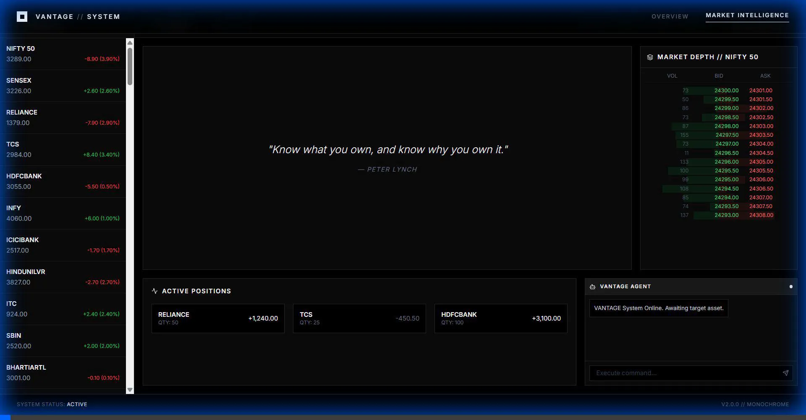

# VANTAGE - Smart Stock Agent

VANTAGE is a powerful, AI-driven market intelligence dashboard that provides real-time stock analysis, interactive charts, and a smart agent capable of answering complex financial queries.



## Features

-   **Smart AI Agent**: Powered by advanced LLMs (Gemini 2.0 Flash via OpenRouter), the agent can analyze stock trends, fetch historical data, and answer natural language queries.
-   **Real-time Interactive Charts**:
    -   **Dynamic Coloring**: Charts automatically turn **Green** (Up Trend) or **Red** (Down Trend) based on performance.
    -   **Multiple Time Ranges**: 1D, 1W, 1M, 3M, 6M, 1Y.
    -   **Chart Types**: Switch between Area and Candlestick views.
-   **Comprehensive Watchlist**:
    -   Track 100+ top Indian stocks (NIFTY 50, SENSEX, etc.).
    -   **Stable Data**: Deterministic mock data ensures consistent values without flickering.
    -   **Smart Layout**: Clear display of Symbol, Price, Change, and Percentage.
-   **Market Depth**: Dynamic Bid/Ask panel that updates based on the selected stock.
-   **Top Bar Indices**: Always-visible tickers for NIFTY 50 and SENSEX.

## Dynamic Charting

The application features a sophisticated charting engine that visually indicates market sentiment.


## Tech Stack

-   **Frontend**: React, TypeScript, Tailwind CSS, Recharts, Lucide React.
-   **Backend**: FastAPI, Python, LangChain, LangGraph.
-   **AI/LLM**: OpenRouter API (Google Gemini 2.0 Flash).
-   **Data**: yfinance (Yahoo Finance API).

## Setup & Installation

### Prerequisites
-   Node.js (v16+)
-   Python (v3.10+)
-   OpenRouter API Key

### Backend Setup

1.  Navigate to the backend directory:
    ```bash
    cd backend
    ```
2.  Create a virtual environment and activate it:
    ```bash
    python -m venv venv
    # Windows
    venv\Scripts\activate
    # Mac/Linux
    source venv/bin/activate
    ```
3.  Install dependencies:
    ```bash
    pip install -r requirements.txt
    ```
4.  Create a `.env` file in the `backend` directory and add your API key:
    ```env
    OPENROUTER_API_KEY=your_api_key_here
    ```
5.  Start the backend server:
    ```bash
    uvicorn main:app --reload
    ```
    The backend will run on `http://localhost:8000`.

### Frontend Setup

1.  Navigate to the frontend directory:
    ```bash
    cd frontend
    ```
2.  Install dependencies:
    ```bash
    npm install
    ```
3.  Start the development server:
    ```bash
    npm run dev
    ```
    The application will run on `http://localhost:5173`.

## Usage

1.  **Select a Stock**: Click on any stock in the watchlist to load its chart and market depth.
2.  **Ask the Agent**: Type queries like "Analyze TCS" or "Show me the 1 year trend for Reliance" in the chat bar.
3.  **Analyze Trends**: Use the time range selectors to view different historical periods.

## License

MIT
